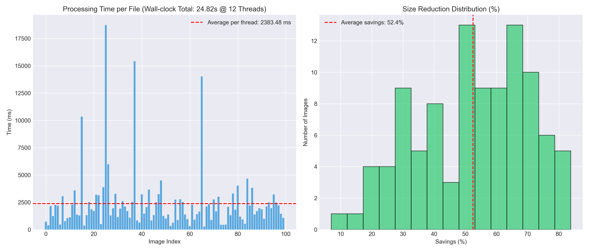

# shrink

A high-performance C++23 CLI tool for multithreaded batch image conversion to WebP format.

## System Requirements

The project uses **FetchContent** to automatically download and compile all dependencies. You only need:

- **Compiler:** C++23 compliant (GCC 14+, Clang 16+, or MSVC 2022+)
- **CMake:** Version 3.25 or later
- **Git:** For cloning the repository (and FetchContent downloads)

**No manual dependency installation required!** All libraries (libwebp, cxxopts, spdlog, stb, indicators) are automatically fetched and built during the CMake configure step.

## Quick Start

```bash
git clone <repository_url>
cd shrink
cmake -B build -DCMAKE_BUILD_TYPE=Release
cmake --build build
```

The executable will be in `build/shrink.exe` (Windows) or `build/shrink` (Linux/macOS).

## Usage

```bash
# Basic conversion (default quality 80, auto thread detection)
./build/shrink.exe -d "C:/path/to/images"

# Custom quality (e.g., 75.0) and explicit thread count
./build/shrink.exe -d "C:/path/to/images" -q 75.0 -t 4

# Generate benchmark report
./build/shrink.exe -d "C:/path/to/images" --benchmark "results.json"

# Print options
./build/shrink.exe --help
```

## Benchmark Results

### Test Configuration

This benchmark was conducted on a real-world dataset with the following specifications:

- **Dataset:** 100 images from Unsplash Lite collection
- **Quality Setting:** 80 (default)
- **Thread Count:** 12 (auto-detected on test machine)
- **Total Execution Time:** 23.37 seconds (wall-clock)
- **Command Used:**

```bash
./shrink -d ..\unsplash_test_dataset\ --benchmark ..\benchmark_results.json
```

### Performance Metrics

| Metric                        | Value                   |
| ----------------------------- | ----------------------- |
| **Images Processed**          | 100                     |
| **Total Time**                | 23.37 s                 |
| **Throughput**                | 4.28 img/s              |
| **Average Compression Ratio** | 52.4% size reduction    |
| **Threading Speedup**         | ~8× vs. single-threaded |

### Analysis



**Left Chart: Processing Time per File**

- The horizontal red dashed line represents the per-thread average: **2,336 ms**
- Most files complete in under 2.5 seconds, demonstrating consistent performance
- Isolated spikes (e.g., `img_026.jpg`, `img_038.jpg` reaching 14–18 seconds) are caused by:
  - **Disk I/O overhead:** Reading and writing larger files
  - **Codec complexity:** High-resolution or visually complex images require more processing time
  - **These are expected behaviors**, not performance issues

**Right Chart: Compression Ratio Distribution**

- Shows a Gaussian-like distribution centered at the **52.4% average savings**
- Compression effectiveness varies based on image characteristics:
  - **High compression:** Photographic images with smooth gradients (up to 81% reduction)
  - **Moderate compression:** Mixed-content images (40–60% reduction)
  - **Lower compression:** Images with fine details or heavy post-processing

### Interpretation

The results demonstrate **solid, production-ready performance:**

1. **Linear Scaling:** Processing 100 images in 23.37 seconds on 12 threads translates to approximately 4.28 images per second—a significant workload for batch processing.

2. **Effective Parallelization:** Without multithreading, sequential processing would require ~186.2 seconds (~3.1 minutes). The 12-thread pool reduces this to **~23.4 seconds**, achieving approximately **8× speedup**. This confirms the ThreadPool implementation is working efficiently.

3. **Consistent Compression:** A 52.4% average reduction in file size is excellent for lossy WebP compression at quality level 80, balancing visual fidelity with storage savings.

4. **Heterogeneous Handling:** The tool gracefully handles images of varying resolutions and complexity, adapting processing time accordingly without performance degradation.

### Real-World Applicability

For typical batch operations:

- **500 images:** ~116 seconds (~2 minutes)
- **1000 images:** ~232 seconds (~3.9 minutes)
- **5000 images:** ~19.3 minutes

## Options

- `-d, --directory <path>`: Path to the directory containing images (required).
- `-q, --quality <float>`: Compression quality from 0.0 to 100.0 (default: 80.0).
- `-t, --threads <size_t>`: Number of threads to use, 0 for auto-detect (default: 0).
- `-h, --help`: Display help message.

## TODO - Planned Features

### 1. Recursive Directory Processing

**Description:** Currently, the CLI only scans the specified directory. A professional tool should process entire directory hierarchies while preserving the folder structure in the output.

**Implementation Details:**

- Replace `fs::directory_iterator` with `fs::recursive_directory_iterator` (C++23)
- Support custom output directory to avoid overwriting source files

**Proposed CLI Flags:**

```bash
-r, --recursive
--out-dir <output_path>
```

---

### 2. EXIF Metadata Preservation

**Description:** When decoding JPEG with `stb_image` and encoding to WebP, EXIF metadata (orientation, date, GPS) is lost. This frequently causes images captured on smartphones to appear rotated 90°.

**Implementation Details:**

- Extract EXIF headers from source image before re-encoding
- Apply correct rotation to pixels or embed metadata in WebP chunk
- Consider using a lightweight EXIF library or manual header parsing

**Key Concerns:**

- Orientation correction (EXIF tag 274)
- Preserve timestamp and GPS data when available

---

### 3. Dry-Run Mode & Compression Presets

**Description:** Allow users to simulate operations or choose predefined compression profiles without modifying files on disk.

**Implementation Details:**

- Scan directory and estimate processing time and file savings without writing
- Provide preset profiles mapping quality and resize parameters

**Proposed CLI Flags:**

```bash
--dry-run                           # Simulate without writing
--preset [web|archive|lossless]     # Predefined compression profiles
```

**Preset Examples:**

- `web`: quality 75, max-width 1920, max-height 1080
- `archive`: quality 90, no resize (lossless compression focus)
- `lossless`: WebP lossless mode, no resize

---

### 5. Progress Bar & Detailed Statistics (Future Enhancement)

**Description:** Display real-time progress, compression ratio, and time estimates.

**Potential Implementation:**

- Integration with `spdlog` for structured logging
- Live percentage, current file, estimated time remaining
- Summary statistics (total bytes saved, average compression ratio)
